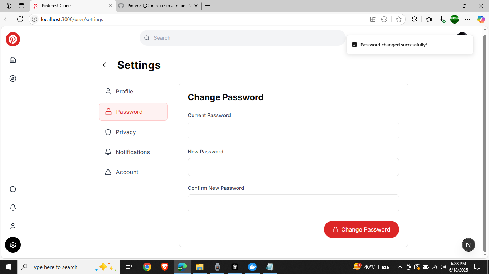
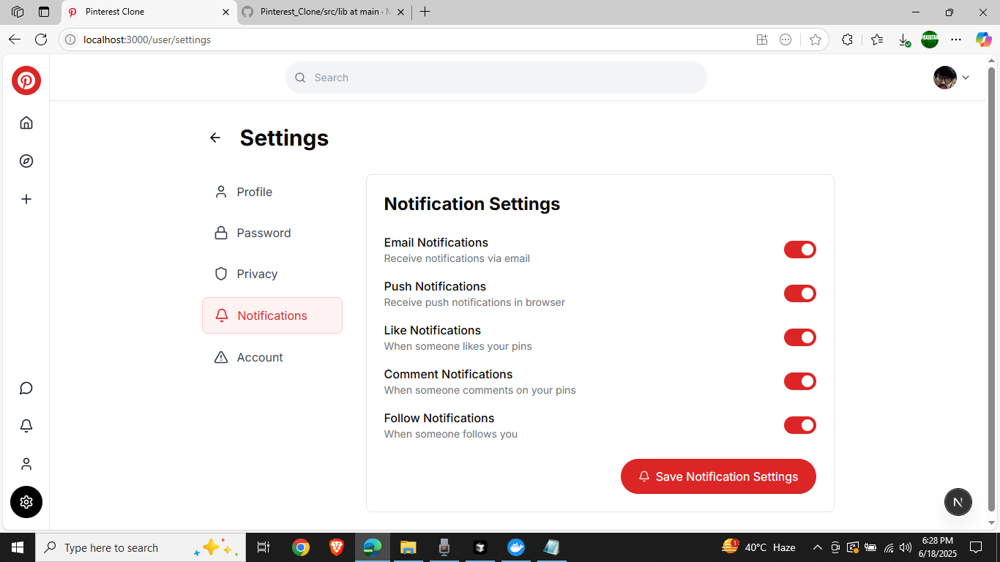

# 📌 Pinterest Clone

A full-featured Pinterest clone built with Next.js 14, featuring user authentication, pin management, user discovery, privacy controls, and a modern responsive design.

## ✨ Features

### 🔐 Authentication & User Management
- **Google OAuth Integration** with NextAuth.js
- **User Registration & Login** with email/password
- **Profile Management** with avatar uploads
- **Privacy Settings** with granular controls

### 📍 Pin Management
- **Create Pins** with image uploads via Cloudinary
- **Save & Like** functionality with real-time updates
- **Masonry Grid Layout** for optimal viewing
- **Pin Details** with full-screen view and interactions

### 👥 User Discovery & Social Features
- **User Search** with privacy-respecting results
- **Follow System** with public/private profile support
- **User Profiles** with created and saved pins
- **Privacy Controls** for profile and search visibility

### 🎨 Modern UI/UX
- **Pinterest-inspired Design** with clean, modern interface
- **Responsive Layout** optimized for all devices
- **Sidebar Navigation** with intuitive iconography
- **Real-time Updates** with optimistic UI patterns

## 📁 Project Structure

```
pinterest-clone/
├── src/
│   ├── app/                    # Next.js App Router pages
│   │   ├── api/               # API routes
│   │   ├── auth/              # Authentication pages
│   │   ├── create/            # Pin creation
│   │   ├── pin/[id]/          # Pin details
│   │   ├── search/            # Search functionality
│   │   └── user/              # User profiles & settings
│   ├── components/            # Reusable UI components
│   │   ├── navbar/            # Navigation components
│   │   ├── masonry/           # Grid layout
│   │   └── providers/         # Context providers
│   └── lib/                   # Utility functions
├── prisma/                    # Database schema & migrations
├── public/                    # Static assets
└── images/                    # Project screenshots
```

## 🚀 Getting Started

### Prerequisites
- Node.js 18+ 
- npm/pnpm/yarn
- Google Cloud Console account (for OAuth)
- Cloudinary account (for image uploads)

### Installation

1. **Clone the repository**
   ```bash
   git clone https://github.com/Mkaify/Pinterest_Clone.git
   cd Pinterest_Clone
   ```

2. **Install dependencies**
   ```bash
   npm install
   # or
   pnpm install
   # or
   yarn install
   ```

3. **Environment Setup**
   ```bash
   cp env.example .env.local
   ```
   
   Fill in your environment variables in `.env.local`:
   ```env
   # Database
   DATABASE_URL="file:./dev.db"  # SQLite for development
   
   # NextAuth
   NEXTAUTH_URL="http://localhost:3000"
   NEXTAUTH_SECRET="your-nextauth-secret-here"
   
   # Google OAuth
   GOOGLE_CLIENT_ID="your-google-client-id"
   GOOGLE_CLIENT_SECRET="your-google-client-secret"
   
   # Cloudinary
   CLOUDINARY_CLOUD_NAME="your-cloud-name"
   CLOUDINARY_API_KEY="your-api-key"
   CLOUDINARY_API_SECRET="your-api-secret"
   ```

4. **Database Setup**
   ```bash
   npx prisma generate
   npx prisma db push
   ```

5. **Run the development server**
   ```bash
   npm run dev
   # or
   pnpm dev
   # or
   yarn dev
   ```

6. **Open your browser**
   Navigate to [http://localhost:3000](http://localhost:3000)

## 🛠️ Tech Stack

- **Framework**: Next.js 14 (App Router)
- **Language**: TypeScript
- **Styling**: Tailwind CSS
- **Database**: Prisma ORM with SQLite/PostgreSQL
- **Authentication**: NextAuth.js with Google OAuth
- **Image Upload**: Cloudinary
- **UI Components**: Custom components with Tailwind
- **Icons**: Heroicons
- **Deployment**: Vercel/Netlify ready

## 🚢 Deployment

### Vercel (Recommended)
1. Push code to GitHub
2. Connect repository to Vercel
3. Configure environment variables
4. Deploy automatically

### Environment Variables for Production
- Use PostgreSQL for production database
- Update `NEXTAUTH_URL` to your domain
- Configure OAuth callbacks for production domain

## 📸 Screenshots

### 🏠 Home & Feed
<table>
  <tr>
    <td align="center">
      
      <br/><b>Guest View</b>
    </td>
    <td align="center">
      
      <br/><b>Login/SignUp</b>
    </td>
  </tr>
</table>

### 🔍 Search & Discovery
<table>
  <tr>
    <td align="center">
      
      <br/><b>Home Feed</b>
    </td>
    <td align="center">
      
      <br/><b>User Discovery & Search</b>
    </td>
  </tr>
</table>

### 👤 User Profiles & Social Features
<table>
  <tr>
    <td align="center">
      
      <br/><b>Searching</b>
    </td>
    <td align="center">
      
      <br/><b>Explore</b>
    </td>
  </tr>
</table>

### 📌 Pin Details & Interactions
<table>
  <tr>
    <td align="center">
      
      <br/><b>Create Pin</b>
    </td>
    <td align="center">
      
      <br/><b>Messages/Inbox</b>
    </td>
  </tr>
</table>

### ➕ Create & Upload
<table>
  <tr>
    <td align="center">
      
      <br/><b>Updates Pop-Up</b>
    </td>
    <td align="center">
      
      <br/><b>Favourite Pins</b>
    </td>
  </tr>
</table>

### 🔐 Authentication
<table>
  <tr>
    <td align="center">
      
      <br/><b>User Profile</b>
    </td>
    <td align="center">
      
      <br/><b>Settings Dashboard</b>
    </td>
  </tr>
</table>

### ⚙️ Settings & Privacy
<table>
  <tr>
    <td align="center">
      
      <br/><b>Profile Settings</b>
    </td>
    <td align="center">
      
      <br/><b>Password Settings</b>
    </td>
  </tr>
</table>

### 📱 Responsive Design
<table>
  <tr>
    <td align="center">
      
      <br/><b>Privacy Settings</b>
    </td>
    <td align="center">
      
      <br/><b>Notification Settings</b>
    </td>
    <td align="center">
      
      <br/><b>Account Settings</b>
    </td>
  </tr>
</table>

## 🤝 Contributing

1. Fork the repository
2. Create your feature branch (`git checkout -b feature/AmazingFeature`)
3. Commit your changes (`git commit -m 'Add some AmazingFeature'`)
4. Push to the branch (`git push origin feature/AmazingFeature`)
5. Open a Pull Request

## 📄 License

This project is open source and available under the [MIT License](LICENSE).

## 👨‍💻 Developer

Created by [Mkaify](https://github.com/Mkaify)

---

⭐ **Star this repository if you found it helpful!**
